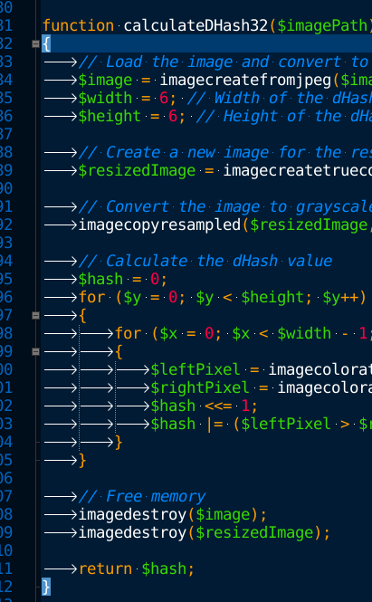

# geany-colorscheme-cobalt

Dark-blue color scheme for Geany with current line highlighting, improved matching braces highlight and 
if whitespace display enabled - reduced contrast of the whitespace.
TODO: find out how to change color for identifiers like 'object', 'array' to 'teal_blue'.

## Installation

To install the scheme locally for the current user, simply copy the
`cobalt.conf` file to `~/.config/geany/colorschemes/`.

For a global installation, a copy needs to be put into
`/usr/share/geany/colorschemes/`.

P.S. If you like the code style on the screenshot, here is a guide to reformat automatically:
https://gist.github.com/AGenchev/a53ecf94ee7b0a910c10826e5d7417f9
